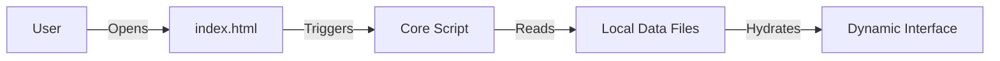

# Zero-Dependency Static CMS Architecture


## 📐 Architectural Concept
This project implements a **fully portable, serverless Content Management System** where the "Presentation Layer" (HTML/CSS) is decoupled from the "Data Layer" (JSON), yet requires **no backend or build process**.

Unlike complex frameworks (React/Vue) or Static Site Generators (Jekyll/Hugo), this architecture runs natively in the browser. It demonstrates how to build a scalable, data-driven interface using **Pure JavaScript (Vanilla JS)** principles.

### The "No-Build" Philosophy
* **No Node.js / NPM required.**
* **No Compilation / Webpack required.**
* **No Local Server required.**
* Just double-click `index.html` and the system hydrates the UI from the JSON data.



## 🚀 Key Features

### 1. JSON-Driven Content Engine

Content is managed via structured JSON files in the `/data` directory.

* **Separation of Concerns:** To update your CV, add a project, or write a blog post, you only modify the JSON. The HTML structure remains untouched.
* **Context-Aware Rendering:** The engine automatically detects the page context (e.g., `projects.html` vs `blog.html`) and loads the appropriate data schema.

### 2. Client-Side Localization (i18n)

* Multi-language support is handled natively.
* The system swaps content keys (e.g., `"en"` vs `"tr"`) instantly based on user selection, without page reloads.

### 3. Markdown Integration

* Includes a lightweight markdown parser to render blog posts and project descriptions directly from text files, allowing for rich-text formatting without database complexity.

## 📂 Repository Structure

```text
├── data/               # THE "DATABASE" (JSON Files)
│   ├── blog.json       # Blog posts & metadata
│   ├── content.json    # CV, Bio, Skills
│   └── projects.json   # Portfolio items
├── script/             # THE ENGINE
│   ├── main.js         # Core rendering logic
│   └── utils.js        # Helper functions
├── templates/          # View Templates
└── index.html          # Entry Point

```

## 🛠 Usage

This is a **Plug-and-Play** architecture.

1. **Clone or Download** the repository.
2. **Double-click** `index.html` to launch the application in your default browser.
3. **Customize:** Edit files in the `/data` folder to reflect your own profile.

---

*Designed by **Muhammet Işık** to demonstrate efficient, dependency-free software architecture.*
